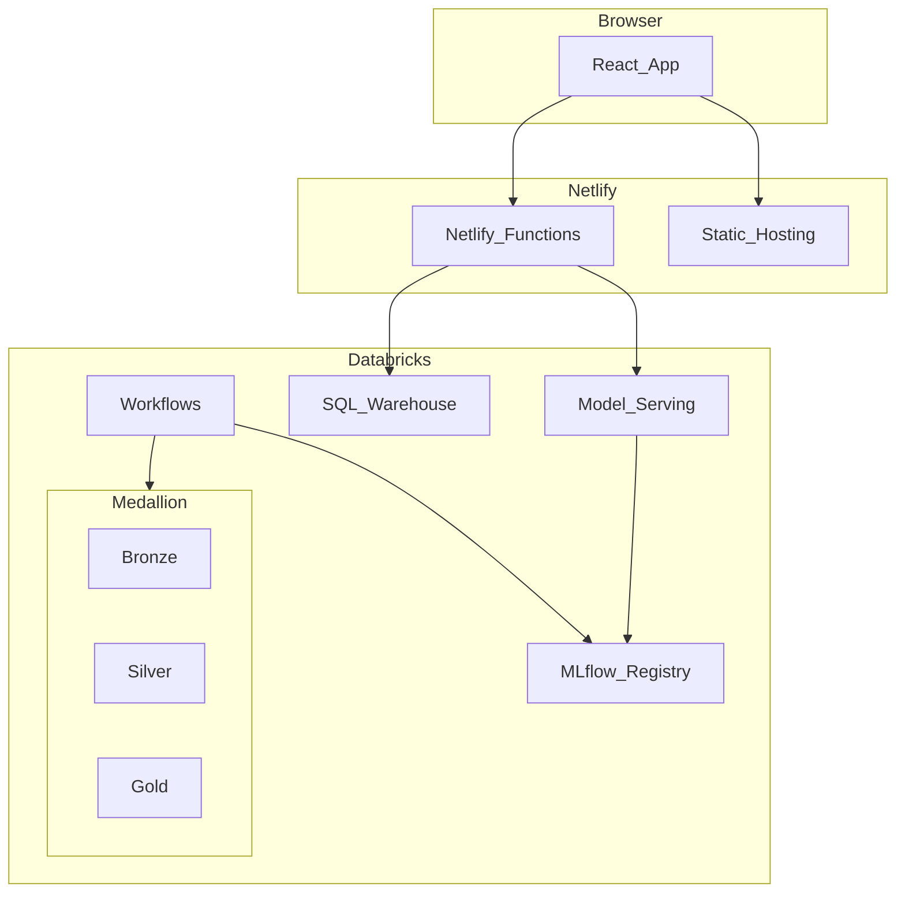

# Architecture

## Overview

This application predicts Dutch house sale prices from listing characteristics. It demonstrates a complete ML system lifecycle in a demo-sized, production-inspired architecture.

## Component Responsibilities

### Frontend (`apps/web`)

- Property input form, predictions list, actual sale entry, monitoring dashboard
- Typed API client — **never** holds Databricks credentials
- Business logic delegated to API and ML package

### API Layer (`netlify/functions`)

- Request validation (Zod)
- Databricks Model Serving invocation
- Prediction and actual-sale logging to Gold tables
- Monitoring query aggregation
- Fallback chain: primary serving → **peer environment** (staging ↔ production) → business baseline
- Timeout and error handling

### ML Package (`ml/src/house_price_ml`)

- Shared feature pipeline (training + serving)
- Data validation (Bronze → Silver)
- Model training with walk-forward validation
- MLflow pyfunc serving wrapper
- Evaluation metrics and monitoring builders

### Databricks

- **Bronze:** Raw ingest (`bronze.listings_raw`)
- **Silver:** Validated data (`silver.listings_clean`, `silver.listings_rejected`)
- **Gold:** Features, predictions, actuals, evaluations, monitoring
- **Workflows:** ETL, training, evaluation, feature monitoring
- **Model Serving:** Online inference with structured JSON input

## Online Prediction Flow

1. User submits listing form in React app
2. `POST /api/predict` validates input
3. Netlify function calls Databricks serving endpoint (or mock)
4. Model runs shared sklearn pipeline internally
5. Prediction logged to `gold.predictions`
6. Response returned with price, model version, warnings

## Retrospective Evaluation Flow

1. Authorised user submits actual sale via `POST /api/actual-sales`
2. Record inserted into `gold.actual_sales` (prediction preserved)
3. Databricks evaluation workflow joins predictions + actuals
4. Metrics computed (MAE, RMSE, bias, segments) → `gold.model_evaluations`
5. Frontend reads precomputed metrics via `GET /api/monitoring`

## Scalability Boundaries

Each layer scales independently:

- Frontend: CDN
- API: Serverless concurrency
- Serving: Endpoint replicas
- ETL/Training: Databricks job clusters (Pandas → PySpark when needed)
- Monitoring: Precomputed Gold tables

## Security

- Databricks credentials in Netlify environment variables only
- Write operations protected by `DEMO_WRITE_TOKEN`
- Staging/production catalog separation
- Production would use service principals and OAuth (documented in deployment.md)
