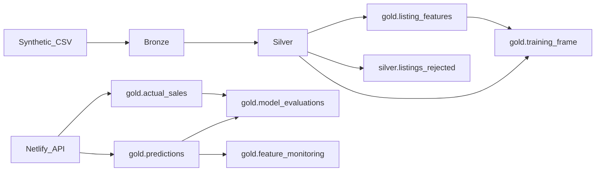

# Data Model

## Medallion Architecture

## Bronze: `bronze.listings_raw`

Raw source data with ingestion metadata. Minimal transformation.

| Column | Type | Description |
|--------|------|-------------|
| listing_id | STRING | Primary key |
| listing_timestamp | TIMESTAMP | When listed |
| region, postcode | STRING | Location |
| latitude, longitude | DOUBLE | Coordinates |
| surface_area | DOUBLE | m² |
| number_of_rooms, number_of_bedrooms | INT | Room counts |
| build_year | INT | Construction year |
| energy_label | STRING | A++ to G |
| property_type | STRING | apartment, terraced_house, etc. |
| garden | BOOLEAN | Has garden |
| asking_price, sale_price | DOUBLE | Prices (nullable) |
| sale_date | DATE | Sale date (nullable) |
| ingestion_timestamp | TIMESTAMP | When ingested |
| ingestion_date | DATE | Partition key (date of ingest) |
| source_file | STRING | Lineage |

## Silver: `silver.listings_clean`

Validated, typed, deduplicated listings with data-quality flags.

**Validation rules:**
- `surface_area > 0`
- `number_of_rooms > 0`
- `build_year <= current year`
- Valid energy label and property type
- Coordinates within NL bounding box

Invalid rows → `silver.listings_rejected`.

## Gold Tables

### `gold.listing_features`

Model-ready features. Safe to build on the full silver table **before** train/test split
because target-derived fields are point-in-time (each row only sees sales with
`sale_date < feature_snapshot_date`). Do **not** use global `groupby` medians here.

| Feature | Source | Split-safe? |
|---------|--------|-------------|
| house_age | snapshot_date − build_year | Yes (row-wise) |
| surface_per_room | surface / rooms | Yes |
| energy_label_score | mapping | Yes |
| surface_x_energy | interaction | Yes |
| dist_to_city_centre_km | haversine | Yes |
| region_median_price_per_sqm | historical aggregate (as-of snapshot) | Yes (past-only) |
| month, quarter | from snapshot date | Yes |

**Note:** `train.py` fits a separate static region-median lookup on the train split
for model serving (see `BusinessBaseline` / `raw_to_feature_frame`). That path is
independent of the gold column above.

### `gold.training_frame` (view)

**Training read surface** — join of `silver.listings_clean` and `gold.listing_features`
on `listing_id`. Model training reads this assembled frame only; it never rebuilds
gold inside `train()`.

| Environment | How training loads data |
|-------------|-------------------------|
| Databricks pipeline | `assemble_training_frame(silver, gold)` or `spark.table("...gold.training_frame")` |
| Local / CI | `data/sample/training_frame.parquet` via `make gold-export` |

ETL (`02_silver_clean`, `03_gold_features`, or `make gold-export`) is the only place
that runs `silver_to_gold_features()`.

### `gold.predictions`

Online prediction log (append-only).

### `gold.actual_sales`

Actual sale results linked to predictions (does not overwrite predictions).

### `gold.model_evaluations`

Precomputed retrospective metrics by segment and time window.

### `gold.feature_monitoring`

Training vs recent feature distributions.

### `gold.serving_metrics`

Daily rollups: API latency (p50/p95), successful request count, errors, timeouts.

### `gold.serving_events`

Failed `/api/predict` requests (validation errors, timeouts, serving failures) for error-rate rollups.

## Feature Ownership

| Transformation | Layer |
|----------------|-------|
| Dtype coercion, dedup, validation | Bronze → Silver |
| Historical aggregates | Silver → Gold |
| Row-level features (age, distance) | Shared sklearn pipeline |
| Out-of-range warnings | Serving + API |

## Environment Separation

| Catalog | Environment |
|---------|-------------|
| `house_price_staging` | local, staging |
| `house_price_prod` | production |

Each catalog has `bronze`, `silver`, `gold` schemas.
