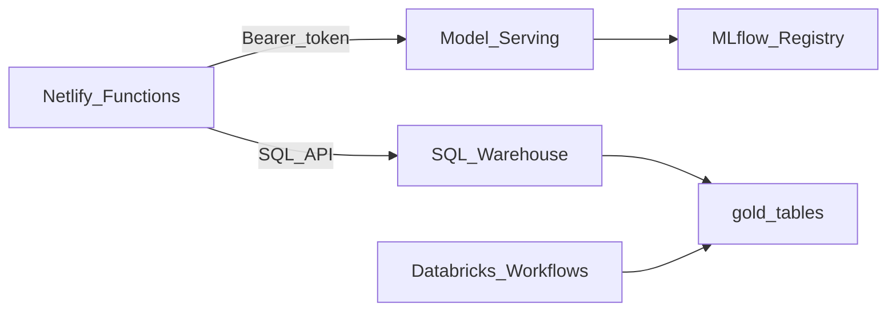

# Databricks Setup Guide

This guide connects the house price app to your Databricks workspace: Unity Catalog, SQL Warehouse, Model Serving, and the Netlify API layer.

## Architecture



## Prerequisites

- Databricks workspace with **Unity Catalog** enabled
- Permission to create catalogs/schemas (or ask an admin)
- **Databricks CLI** installed: `brew install databricks/tap/databricks`
- Personal Access Token (PAT) for setup (service principal for production later)

---

## Step 1: Authenticate Databricks CLI

```bash
databricks auth login --host https://YOUR-WORKSPACE.cloud.databricks.com
```

Or set a token in `~/.databrickscfg`:

```ini
[DEFAULT]
host  = https://YOUR-WORKSPACE.cloud.databricks.com
token = dapiXXXXXXXX
```

---

## Step 2: Create Unity Catalog & Tables

Replace `house_price_staging` if you use a different catalog name.

**Option A — Databricks SQL editor**

Run each file in order (replace `${catalog}` with your catalog name):

1. `databricks/sql/01_bronze.sql`
2. `databricks/sql/02_silver.sql`
3. `databricks/sql/03_gold.sql`

**Option B — CLI script**

```bash
make databricks-init-catalog CATALOG=house_price_staging
```

---

## Step 3: Create a SQL Warehouse

1. In Databricks: **SQL** → **SQL Warehouses** → **Create SQL Warehouse**
2. Choose **Serverless** (simplest for demo) or **Pro**
3. Start the warehouse
4. Open **Connection details** and copy the **HTTP path** segment — the warehouse ID is the last part of the path, e.g. for  
   `/sql/1.0/warehouses/abc123def456` → ID is `abc123def456`

---

## Step 4: Train & Register the Model

**Locally (upload artifact manually):**

```bash
make seed
make gold-export
make train
# Artifact at ml/artifacts/model/mlflow_model
```

**On Databricks (recommended):**

1. Build and upload the Python wheel:
   ```bash
   cd ml && pip wheel . -w dist/
   databricks fs cp dist/house_price_ml-*.whl dbfs:/Shared/house_price_ml.whl
   ```

2. Run notebooks in order (update `%pip install` path in notebooks to match):
   - `01_bronze_ingest` → `02_silver_clean` → `03_gold_features` → `04_train_model`

3. In **MLflow** → **Models** → register `house_price_model`
4. Set aliases:
   - `challenger` — staging candidate
   - `champion` — production
   - `previous_champion` — rollback

---

## Step 5: Create Model Serving Endpoint

**Option A — automated (recommended for demo)**

```bash
make gold-export && make train   # if not already done
make deploy-serving     # registers model + creates endpoint + waits for READY
make verify-databricks  # all 3 checks should pass
```

**Option B — Databricks UI**

1. **Catalog** → register model `house_price_staging.gold.house_price_model` (or run `make deploy-serving`)
2. **Serving** → **Create serving endpoint**
3. Name: `house-price-serving`
4. Model: `house_price_staging.gold.house_price_model` @ alias **`challenger`**
5. Wait until status is **Ready**

Test invocation (replace values):

```bash
curl -X POST "https://YOUR-WORKSPACE.cloud.databricks.com/serving-endpoints/house-price-serving/invocations" \
  -H "Authorization: Bearer $DATABRICKS_TOKEN" \
  -H "Content-Type: application/json" \
  -d '{
    "dataframe_records": [{
      "surface_area": 120,
      "number_of_rooms": 5,
      "number_of_bedrooms": 3,
      "build_year": 1985,
      "energy_label": "B",
      "property_type": "terraced_house",
      "garden": true,
      "region": "Utrecht",
      "latitude": 52.0907,
      "longitude": 5.1214,
      "prediction_date": "2026-07-14"
    }]
  }'
```

---

## Step 6: Configure Environment Variables

Copy and fill in:

```bash
cp .env.example .env
```

| Variable | Where to find it |
|----------|------------------|
| `DATABRICKS_HOST` | Workspace URL, e.g. `https://adb-xxx.azuredatabricks.net` |
| `DATABRICKS_TOKEN` | User Settings → Developer → Access tokens (must include **SQL** scope) |
| `DATABRICKS_SQL_WAREHOUSE_ID` | SQL Warehouse → Connection details |
| `DATABRICKS_SERVING_ENDPOINT` | Serving endpoint name (default: `house-price-serving`) |
| `DATABRICKS_CATALOG` | Unity Catalog name (e.g. `house_price_staging`) |
| `USE_MOCK_DATABRICKS` | Set to `false` when using real Databricks |

Verify connectivity:

```bash
make verify-databricks
```

---

## Step 7: Run Locally Against Databricks

```bash
# .env must have USE_MOCK_DATABRICKS=false and valid credentials
make dev-full
```

Submit a prediction at http://localhost:5173 — you should see a real model version (not `mock-v1`).

---

## Step 8: Netlify (Staging / Production)

In **Netlify** → **Site configuration** → **Environment variables**, set the same variables (never in the frontend):

- `DATABRICKS_HOST`
- `DATABRICKS_TOKEN`
- `DATABRICKS_SQL_WAREHOUSE_ID`
- `DATABRICKS_SERVING_ENDPOINT`
- `DATABRICKS_CATALOG`
- `USE_MOCK_DATABRICKS=false`
- `MODEL_ALIAS=challenger` (staging) or `champion` (production)
- `DEMO_WRITE_TOKEN` — random secret for the “Add Sale” page

Redeploy after changing env vars.

---

## Step 9: Schedule Evaluation Jobs

Deploy workflows:

```bash
cd databricks
databricks bundle deploy -t staging
```

Or run notebooks manually:
- `05_evaluate_model` — retrospective metrics
- `06_feature_monitoring` — feature drift
- `08_serving_metrics` — daily serving latency / error rollups

---

## Troubleshooting

| Symptom | Fix |
|---------|-----|
| `mock-v1` predictions | `USE_MOCK_DATABRICKS` still `true` or missing token |
| `Serving failed: 401` | Regenerate PAT; check token not expired |
| `HTTP 403` + `required scopes: sql` | Create a new PAT with **SQL** scope enabled (see below) |
| `Serving failed: 404` | Endpoint name wrong or not Ready |
| `SQL failed: 403` | Token needs `CAN_USE` on SQL warehouse |
| `TABLE_OR_VIEW_NOT_FOUND` | Run SQL DDL scripts for your catalog |
| Predictions not in UI list | SQL insert failed; check warehouse + catalog permissions |

---

## Production Hardening (later)

- Replace PAT with **service principal** + OAuth
- Separate catalogs: `house_price_staging` / `house_price_prod`
- Restrict warehouse to serverless with budget policies
- Enable audit logging on `gold.actual_sales`
