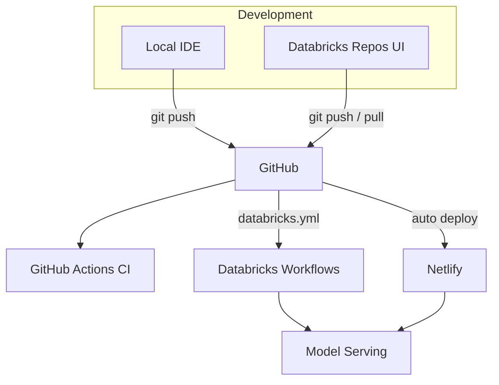

# Enterprise Workflow

Develop on your laptop **or** in the Databricks UI. Production operations run in **GitHub Actions** and **Databricks Jobs** — not on your machine.

## Architecture



## Three ways to work

| Where | Best for | Sync |
|-------|----------|------|
| **Local laptop** | Fast iteration, unit tests, `make dev-full` | `git push` → GitHub |
| **Databricks Repos** | Notebooks, exploring data, running jobs in UI | Two-way sync with GitHub |
| **GitHub Actions** | Deploy, train pipeline, promote — no laptop | Triggered by push or manual |

## One-time setup

### 1. GitHub secrets

In **GitHub → Settings → Secrets and variables → Actions**, add:

| Secret | Purpose |
|--------|---------|
| `DATABRICKS_HOST` | Workspace URL |
| `DATABRICKS_TOKEN` | PAT with all-apis, sql, mlflow, serving |
| `DATABRICKS_SQL_WAREHOUSE_ID` | SQL warehouse for verify / API |

### 2. Link Databricks Repos (optional, for UI editing)

```bash
make setup-databricks-repo
```

Or in Databricks UI: **Repos → Add Repo** → paste your GitHub URL.

After linking you can open `databricks/notebooks/` in the workspace and commit/pull like a normal git repo.

### 3. Deploy bundle jobs to Databricks

```bash
make databricks-bundle-deploy          # staging jobs
make databricks-bundle-deploy-prod     # production jobs
```

Or from GitHub: **Actions → Databricks → Run workflow → bundle-deploy**.

---

## Make command → online equivalent

| Local `make` | Online (GitHub Actions) | Databricks UI |
|--------------|-------------------------|---------------|
| `make test` / `make lint` | Automatic on every PR (`ci.yml`) | — |
| `make databricks-bundle-deploy` | `CMD=bundle-deploy` or push to `staging` | Jobs appear after bundle deploy |
| `make upload-ml-wheel` | Part of `staging-pipeline` | Run upload step in Actions |
| `make train` | `run-pipeline` (train task) | **Workflows → [staging] Full ML Pipeline** |
| `make deploy-serving` | `deploy-serving-local` (CI) or `deploy-serving` after pipeline | After pipeline: Actions → deploy-serving |
| `make deploy-serving-from-registry` | `deploy-serving` in CI | — |
| `make promote-champion` | Actions → `promote-champion` | — |
| `make promote-to-production` | Actions → `promote-to-production` + confirm `yes` | — |
| `make databricks-staging-pipeline` | **Auto on push to `staging`** (ml/databricks changes) | Run **Full ML Pipeline** job manually |
| `make databricks-production-pipeline` | Actions → `production-pipeline` + confirm | — |
| `make verify-databricks` | Actions → `verify` | — |
| `make dev-full` | — | Local only |
| Netlify deploy | Auto on push to `staging` / `master` | — |

### Trigger GitHub Actions from terminal

```bash
# Full staging: bundle + wheel + pipeline + serving
make remote-databricks CMD=staging-pipeline

# Production promotion (requires confirmation in workflow too)
make remote-databricks CMD=production-pipeline TARGET=prod

# Single operation
make remote-databricks CMD=run-pipeline TARGET=staging
```

Requires [GitHub CLI](https://cli.github.com/): `gh auth login`

Or use **GitHub → Actions → Databricks → Run workflow**.

---

## Typical flows

### Develop locally → staging

```bash
make test
git checkout -b feature/my-change
# ... edit code ...
git push origin feature/my-change
# Open PR → CI + Netlify preview + E2E
# Merge to staging → CI + Netlify staging + Databricks staging-pipeline (if ml/ changed)
```

### Develop in Databricks UI

1. Open **Repos → PB-assessment**
2. Edit a notebook under `databricks/notebooks/`
3. **Commit & push** from Repos (or pull locally later)
4. Push to `staging` triggers the same GitHub Actions pipeline

### Promote to production

```bash
# Online (recommended)
# GitHub Actions → Databricks → production-pipeline → confirm_promote: yes

# Or locally (still supported)
CONFIRM_PROMOTE=yes make promote-to-production
```

Then merge `staging` → `master` for the Netlify production frontend (already automatic on push).

---

## Staging pipeline (automated)

On every push to `staging` that touches `ml/` or `databricks/`:

1. Deploy Databricks Asset Bundle (`staging` target)
2. Build & upload `house_price_ml` wheel to `/Workspace/Shared/`
3. Run **Full ML Pipeline** job: bronze → silver → gold → train → evaluate
4. Deploy `house-price-serving` from registry `@challenger` (no local train)

---

## What stays local-only

These are intentionally dev-only (fast feedback, no cloud cost):

- `make dev` / `make dev-full` / `make dev-netlify`
- `make seed` (synthetic CSV for offline work)
- `make test` during active development (CI runs the same checks remotely)

---

## Upgrading auth (optional)

Replace `DATABRICKS_TOKEN` in GitHub with **OIDC + service principal** for production-grade security. See [Databricks GitHub OIDC docs](https://docs.databricks.com/en/dev-tools/auth/provider-github.html).

---

## Troubleshooting

| Issue | Fix |
|-------|-----|
| Pipeline fails on `%pip install` wheel | Re-run `staging-pipeline` (wheel uploads to `/Workspace/Users/<you>/libs/`) |
| `deploy-serving` can't find alias | Run train job / full pipeline first |
| GitHub Action missing secrets | Add `DATABRICKS_HOST` + `DATABRICKS_TOKEN` in repo secrets |
| Repos out of sync | Databricks Repos → pull, or `git pull` locally |
