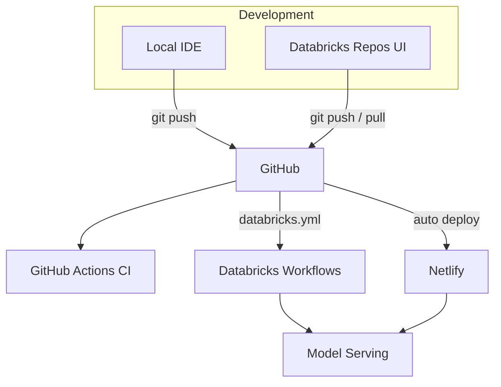
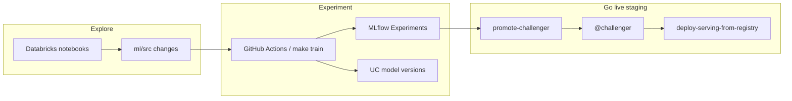

# Enterprise Workflow

Develop on your laptop **or** in the Databricks UI. Production operations run in **GitHub Actions** and **Databricks Jobs** — not on your machine.

## Architecture



## Three ways to work

| Where | Best for | Sync |
|-------|----------|------|
| **Local laptop** | Fast iteration, unit tests, `make dev-full` | `git push` → GitHub |
| **Databricks Repos** | Notebooks, exploring data, running jobs in UI | Two-way sync with GitHub |
| **GitHub Actions** | Deploy, train pipeline, promote — no laptop | Triggered by push or manual |

## One-time setup

### 1. GitHub secrets

In **GitHub → Settings → Secrets and variables → Actions**, add:

| Secret | Purpose |
|--------|---------|
| `DATABRICKS_HOST` | Workspace URL |
| `DATABRICKS_TOKEN` | PAT with all-apis, sql, mlflow, serving |
| `DATABRICKS_SQL_WAREHOUSE_ID` | SQL warehouse for verify / API |

### 2. Link Databricks Repos (optional, for UI editing)

```bash
make setup-databricks-repo
```

Or in Databricks UI: **Repos → Add Repo** → paste your GitHub URL.

After linking you can open `databricks/notebooks/` in the workspace and commit/pull like a normal git repo.

### 3. Deploy bundle jobs to Databricks

```bash
make databricks-bundle-deploy          # staging jobs
make databricks-bundle-deploy-prod     # production jobs
```

Or from GitHub: **Actions → Databricks → Run workflow → bundle-deploy**.

---

## Make command → online equivalent

| Local `make` | Online (GitHub Actions) | Databricks UI |
|--------------|-------------------------|---------------|
| `make test` / `make lint` | Automatic on every PR (`ci.yml`) | — |
| `make databricks-bundle-deploy` | `CMD=bundle-deploy` or push to `staging` | Jobs appear after bundle deploy |
| `make upload-ml-wheel` | Part of `staging-pipeline` | Run upload step in Actions |
| `make train` | `run-pipeline` (train task) | **Workflows → [staging] Full ML Pipeline** |
| `make promote-challenger RUN_ID=…` | — (run locally or add script to CI) | Experiments UI → copy run ID |
| `make deploy-serving-from-registry` | `staging-pipeline-deploy` or `deploy-serving` | After promoting `@challenger` |
| `make deploy-serving` | `deploy-serving-local` (CI) | Register local artifact + alias + endpoint |
| `make promote-champion` | Actions → `promote-champion` | — |
| `make promote-to-production` | Actions → `promote-to-production` + confirm `yes` | — |
| `make databricks-staging-pipeline` | **Auto on push to `staging`** (training code changes) | Run **Full ML Pipeline** job manually |
| `make databricks-staging-pipeline-deploy` | Actions → `staging-pipeline-deploy` | Pipeline + refresh serving endpoint |
| `make verify-databricks` | Actions → `verify` | — |
| `make dev-full` | — | Local only |
| Netlify deploy | Auto on push to `staging` / `master` | — |

### Trigger GitHub Actions from terminal

```bash
# Experiment pipeline only (no serving deploy)
make remote-databricks CMD=staging-pipeline

# Pipeline + refresh staging endpoint (after you promoted @challenger)
make remote-databricks CMD=staging-pipeline-deploy

# Production promotion (requires confirmation in workflow too)
make remote-databricks CMD=production-pipeline TARGET=prod

# Single operation
make remote-databricks CMD=run-pipeline TARGET=staging
```

Requires [GitHub CLI](https://cli.github.com/): `gh auth login`

Or use **GitHub → Actions → Databricks → Run workflow**.

---

## Daily enterprise workflow

A typical day when you explore in Databricks, run experiments, and promote one winner to staging serving.

### Principle

| Phase | Where | Goes live? |
|-------|--------|------------|
| **Explore** | Databricks notebooks / Repos | No |
| **Experiment** | `make train` or CI pipeline | No — logs to MLflow + registers UC version |
| **Promote** | `make promote-challenger` | Yes — sets `@challenger` |
| **Serve** | `make deploy-serving-from-registry` | Yes — staging endpoint uses `@challenger` |

Staging keeps serving the **current** `@challenger` until you explicitly promote and deploy.

### Morning — explore in Databricks

1. Open **Repos → PB-assessment** (branch `staging`).
2. Use notebooks under `databricks/notebooks/` and SQL on bronze/silver/gold tables for ad-hoc analysis.
3. Use notebooks for **scratch work**. Move durable logic into `ml/src/house_price_ml/` when it should be tested properly.

### Midday — run an experiment

When a feature is ready to evaluate:

```bash
# Local (optional)
make test
make train
```

Or commit and push to `staging` (changes under `ml/src/` or `databricks/notebooks/`):

```bash
git add ml/src/house_price_ml/features/…
git commit -m "Add surface-per-room feature"
git push origin staging
```

**GitHub Actions** runs **Full ML Pipeline** (bronze → silver → gold → train → evaluate). The train step:

- Logs to **`/Shared/house_price_prediction`**
- Tags the run with **`git_commit`**, metrics, artifacts
- Registers a new **Unity Catalog model version** (e.g. v13)
- Does **not** set `@challenger` or update the serving endpoint

### Afternoon — compare experiments

In Databricks → **Experiments** → `/Shared/house_price_prediction`:

| Check | Why |
|-------|-----|
| `git_commit` tag | Which code produced the run |
| `test_mae`, walk-forward metrics | Performance |
| `beats_baseline` | Better than business baseline? |
| Artifacts (holdout CSV, feature importance) | Trust and debugging |
| **Models** column | UC version linked to the run |

Repeat push/train cycles as needed — each run is a candidate; staging serving stays unchanged.

### End of day — promote the winner to staging

Pick the best run from the Experiments UI (copy the **Run ID**).

```bash
# 1. Point @challenger at that experiment run
make promote-challenger RUN_ID=<run-id-from-experiments-ui>

# 2. Refresh the staging serving endpoint
make deploy-serving-from-registry
```

The staging app (`staging--pb-assessment.netlify.app`) now uses that model via `house-price-serving` + `@challenger`.

### Flow diagram



### Production (infrequent)

After validating staging `@challenger`:

```bash
CONFIRM_PROMOTE=yes make promote-to-production
```

Then merge `staging` → `master` for the production Netlify frontend.

---

## Typical flows

### Develop locally → staging

```bash
make test
git checkout -b feature/my-change
# ... edit code ...
git push origin feature/my-change
# Open PR → CI + Netlify preview + E2E
# Merge to staging → CI + Netlify staging + Databricks pipeline (if training code changed)
```

### Develop in Databricks UI

1. Open **Repos → PB-assessment**
2. Edit a notebook under `databricks/notebooks/`
3. **Commit & push** from Repos (or pull locally later)
4. Push to `staging` triggers the same GitHub Actions pipeline

### Promote to production

```bash
# Online (recommended)
# GitHub Actions → Databricks → production-pipeline → confirm_promote: yes

# Or locally (still supported)
CONFIRM_PROMOTE=yes make promote-to-production
```

Then merge `staging` → `master` for the Netlify production frontend (already automatic on push).

---

## Staging pipeline (automated)

On every push to `staging` that touches training-related paths:

| Files changed | Auto action |
|---------------|-------------|
| `ml/src/**` or `databricks/notebooks/**` | `staging-pipeline` — full data + train pipeline (**no serving deploy**) |
| `databricks/**` (config/scripts only) or other paths | `bundle-deploy` only (sync jobs + wheel artifact, **no retrain**) |
| Frontend / docs only | Nothing (Netlify CI runs separately) |

To refresh the serving endpoint after promoting `@challenger`, run manually:

- **Actions → Databricks → `staging-pipeline-deploy`**, or
- `make deploy-serving-from-registry` locally

Full experiment pipeline is also available manually: **Actions → Databricks → `staging-pipeline`**.

---

## What stays local-only

These are intentionally dev-only (fast feedback, no cloud cost):

- `make dev` / `make dev-full` / `make dev-netlify`
- `make seed` (synthetic CSV for offline work)
- `make test` during active development (CI runs the same checks remotely)

---

## Upgrading auth (optional)

Replace `DATABRICKS_TOKEN` in GitHub with **OIDC + service principal** for production-grade security. See [Databricks GitHub OIDC docs](https://docs.databricks.com/en/dev-tools/auth/provider-github.html).

---

## Troubleshooting

| Issue | Fix |
|-------|-----|
| Pipeline fails on wheel / import | Re-run `staging-pipeline` (wheel is built via bundle artifacts) |
| `git_commit: unknown` in experiment | Ensure CI passes `git_commit` job param; re-run after latest bundle deploy |
| No model in Experiments **Models** column | Train registers UC version when workspace credentials are available; check train task logs |
| `deploy-serving` can't find alias | Run `make promote-challenger RUN_ID=…` first |
| GitHub Action missing secrets | Add `DATABRICKS_HOST` + `DATABRICKS_TOKEN` in repo secrets |
| Repos out of sync | Databricks Repos → pull, or `git pull` locally |
