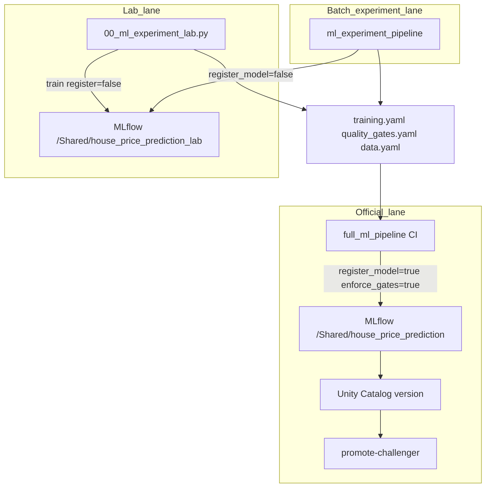

# Experiment Workflow

Three **training lanes** separate exploration from official model registration. Use the right lane so lab runs never create Unity Catalog versions by accident.

## Three lanes



| Lane | Entry | `register_model` | `enforce_gates` | MLflow experiment | UC register |
|------|--------|------------------|-----------------|-------------------|-------------|
| Lab notebook | [`00_ml_experiment_lab.py`](../databricks/notebooks/00_ml_experiment_lab.py) | `False` | `False` (default) | `_lab` | No |
| Batch experiment | [`ml_experiment_pipeline`](../databricks/databricks.yml) | `false` | `False` | `_lab` | No |
| Official CI | [`full_ml_pipeline`](../databricks/databricks.yml) | `true` | `True` | production | Yes if gates pass |

Runs in lab and batch lanes are tagged `training_lane=experiment`. Official runs use `training_lane=official`.

When `register_model=False` and `enforce_gates` is unset, training logs gate results but does not fail the job or register to UC.

---

## When to use each lane

### Lab notebook (`00_ml_experiment_lab.py`)

Best for interactive work in Databricks Repos:

- Delta catalog data **or** in-memory synthetic sample (`data_source` widget)
- Data quality, segment balance, baseline holdout
- Quick train and gate drill-down without UC registration
- Deep experiment section (tuning + ablation + SHAP) with same flags as the batch job

Default MLflow experiment: `/Shared/house_price_prediction_lab`.

### Batch experiment (`ml_experiment_pipeline`)

Best when you want a full bronze → gold → train run on staging data with experiment flags on, still **without** UC registration:

```bash
./scripts/databricks-ci.sh run-experiment-pipeline staging
```

Use after committing YAML/config changes you validated in the lab notebook.

### Official CI (`full_ml_pipeline`)

Triggered by push to `staging` (when training code or notebooks change). This is the **only** lane that registers UC model versions when quality gates pass.

```bash
git push origin staging
```

---

## What gets registered where

| Artifact | Lab / batch experiment | Official CI |
|----------|------------------------|-------------|
| MLflow metrics + artifacts | Yes (`_lab` experiment) | Yes (production experiment) |
| `gate_report.json` | Yes (informational) | Yes (enforced when registering) |
| Unity Catalog model version | **No** | Yes when `gates_passed=1` |
| `@challenger` alias | No | No (use `promote-challenger`) |

---

## Promotion path

Promotion and serving deploy use **official** experiment runs only:

1. Pick a run from `/Shared/house_price_prediction` with `gates_passed=1` and `beats_baseline=1`.
2. `make promote-challenger RUN_ID=<run-id>`
3. `make deploy-serving-from-registry`

Lab runs in `_lab` are for comparison and debugging — do not promote them.

---

## YAML export checklist

Before `git push origin staging`, commit:

| File | When to change |
|------|----------------|
| [`ml/config/training.yaml`](../ml/config/training.yaml) | Hyperparameters; keep `tuning.enabled: false` for prod CI |
| [`ml/config/quality_gates.yaml`](../ml/config/quality_gates.yaml) | Gate thresholds after lab gate drill-down |
| [`ml/config/data.yaml`](../ml/config/data.yaml) | Synthetic profile or data assumptions |
| `ml/src/` | Feature or training code changes |

---

## Acceptance checklist (first end-to-end use)

1. Run lab notebook sections 1–6 with `data_source=sample` — MLflow run appears in `_lab`, no new UC version.
2. Run `./scripts/databricks-ci.sh run-experiment-pipeline staging` — confirm `register_model=false`, artifacts include ablation/SHAP if enabled, no UC version.
3. Push to `staging` — `full_ml_pipeline` registers only if gates pass.
4. `promote-challenger` on an official run with `gates_passed=1` only.

---

## Related docs

- [enterprise-workflow.md](enterprise-workflow.md) — daily development and promotion
- [configuration.md](configuration.md) — job parameters and MLflow experiments
- [model_lifecycle.md](model_lifecycle.md) — validation, gates, and registry aliases
