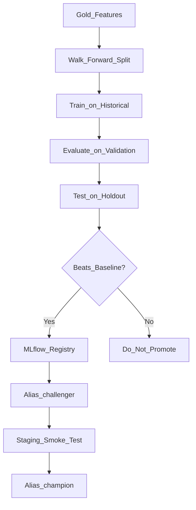

# Model Lifecycle

## Models

| Model | Purpose |
|-------|---------|
| Business baseline | Median €/m² by region × property type × surface |
| Ridge regression | Linear baseline with engineered features |
| Random Forest | Primary tree-based model |

## Training Pipeline

Hyperparameters and validation splits are defined in [`ml/config/training.yaml`](../ml/config/training.yaml). `train.py` loads this file by default (override with `--config` or `TRAINING_CONFIG_PATH`).



## Validation Strategy

- **Walk-forward validation** across quarterly splits
- **Final holdout test set** (last 2 quarters) — never used during iteration
- No random splits (prevents temporal leakage)

## MLflow Logging

Each experiment logs:
- Model parameters and metrics
- Feature list and `feature_pipeline_version`
- Git commit hash
- Training date and data table reference
- Validation approach
- Model artifact with shared preprocessing pipeline

## Registry Aliases

| Alias | Usage |
|-------|-------|
| `challenger` | Staging deployment |
| `champion` | Production deployment |
| `previous_champion` | Rollback target |

## Promotion Criteria

Production promotion requires:
1. All CI tests pass
2. Candidate beats business baseline on holdout
3. Performance within threshold of current champion
4. Staging smoke test passes
5. Manual approval

**Models are not automatically retrained when new data arrives.**

## Shared Feature Pipeline

A single sklearn `Pipeline` + `ColumnTransformer` is packaged in the MLflow pyfunc model:

- Training: `ml/src/house_price_ml/models/train.py`
- Serving: `ml/src/house_price_ml/serving/mlflow_model.py`

The served model accepts human-readable listing JSON, not undocumented feature vectors.

## Fallback Hierarchy

1. Primary alias (champion/challenger)
2. `previous_champion`
3. Business baseline (computed in API layer)
4. Controlled error response

## Rollback

Set `champion` alias to `previous_champion` version in MLflow registry. No frontend changes required.

## Promote staging → production

```bash
cd ml && python ../scripts/promote-to-production.py --dry-run
CONFIRM_PROMOTE=yes make promote-to-production
```

Copies `house_price_staging.gold.house_price_model@challenger` into `house_price_prod`, sets `champion` / `previous_champion`, deploys `house-price-serving-prod`, and writes `ml/artifacts/promotions/last-promotion.json`.
