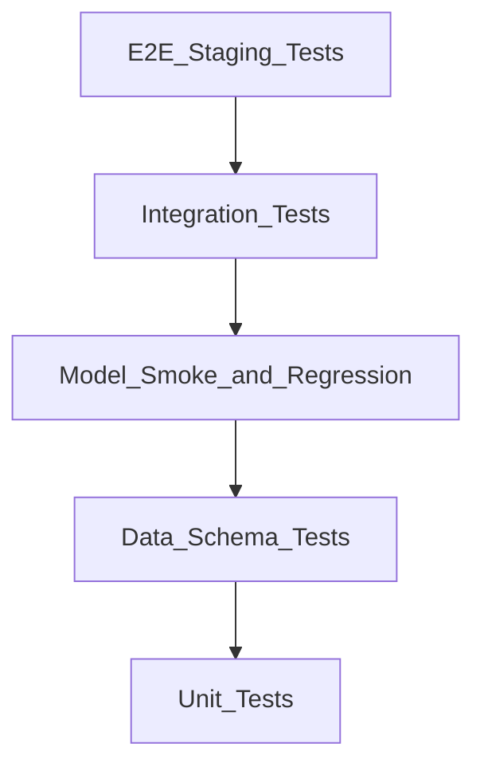

# Testing Strategy

## Test Pyramid



## Python Tests (`ml/tests/`)

### Unit Tests
- House age, haversine distance, energy label mapping
- Validation rules, metric calculations
- Location: `ml/tests/unit/`

### Data & Schema Tests
- Required columns, dtype validation
- Invalid value rejection, duplicate handling
- Location: `ml/tests/data/`

### Model Smoke Tests
- Artifact loads, accepts valid input
- Prediction is positive and finite
- Location: `ml/tests/model/test_smoke.py`

### Model Regression Tests
- Beats business baseline on golden dataset
- Robustness: small/large houses, edge cases
- Location: `ml/tests/model/`

## TypeScript Tests

### API Schema Tests
- Zod validation for predict and actual-sale requests
- Location: `netlify/functions/_shared/schemas.test.ts`

### Frontend Tests
- Format utilities
- Location: `apps/web/tests/`

## Integration Tests (`tests/integration/`)

Full path: validation → features → training → artifact

## E2E Tests (`tests/e2e/`)

Against staging deployment (`STAGING_URL` env var):
1. POST predict → receive prediction
2. GET predictions → verify stored
3. POST actual sale
4. Verify monitoring data

**Post-promote inference** (`tests/e2e/test_serving_promote.py`): run automatically after
`make deploy-serving-from-registry` (or Actions `deploy-serving`). Asserts real Databricks
serving via Netlify — not baseline/mock fallback.

Locally: documents expected steps (mock mode).

## CI Pipeline (`.github/workflows/pr.yml`)

On pull request:
- Frontend: lint, typecheck, vitest
- Python: ruff, mypy, pytest (unit + schema + smoke)
- Integration tests

## Running Tests

```bash
make test          # All tests
make test-ml       # Python only
make test-web      # TypeScript only
make test-integration
make test-e2e      # Requires STAGING_URL
```

## Model Quality Gates

Gates are defined in [`ml/config/quality_gates.yaml`](../ml/config/quality_gates.yaml) and
enforced in [`ml/src/house_price_ml/evaluation/gates.py`](../ml/src/house_price_ml/evaluation/gates.py).

| Gate | Threshold | Enforced when |
|------|-----------|---------------|
| Beats baseline | MAE < baseline MAE on holdout | `train --register` (default) |
| MAE vs baseline ratio | model MAE ≤ 110% of baseline | training |
| pct_within_10pct | ≥ 50% within ±10% of actual | training |
| Walk-forward | model MAE < baseline mean | training |
| Segment degradation | no segment MAE > 115% of overall | training (min 5 samples) |
| Champion promotion | challenger MAE ≤ 110% of prod champion | `promote-to-production` |

CI uses the 500-row golden fixture with [`quality_gates_ci.yaml`](../ml/config/quality_gates_ci.yaml).
Production/staging training (`make seed` → 10k rows) enforces full [`quality_gates.yaml`](../ml/config/quality_gates.yaml).

`promote-challenger` refuses runs where `beats_baseline=0` or `gates_passed=0`.
